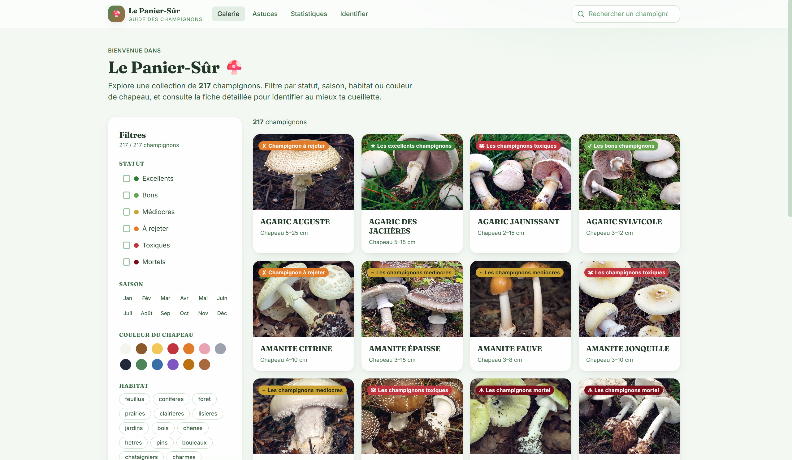
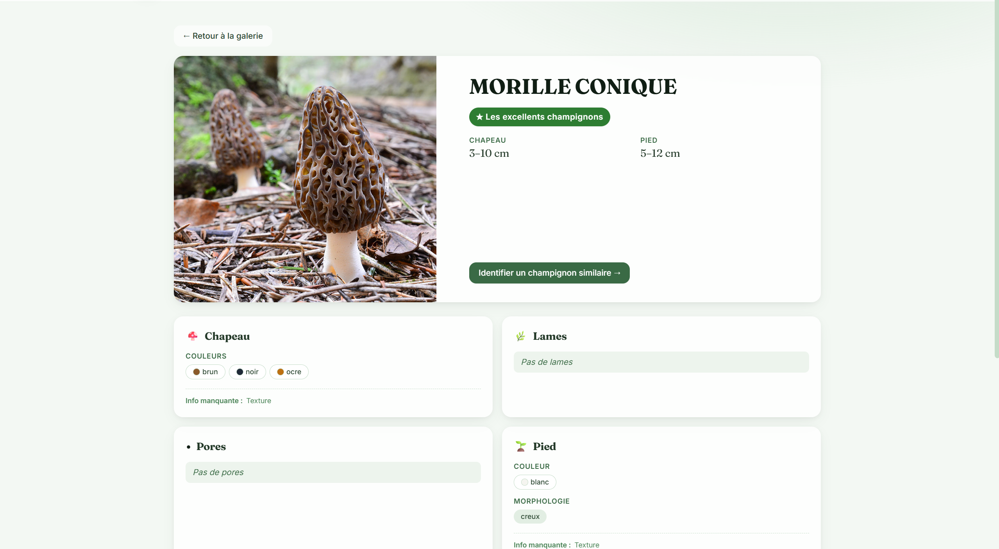
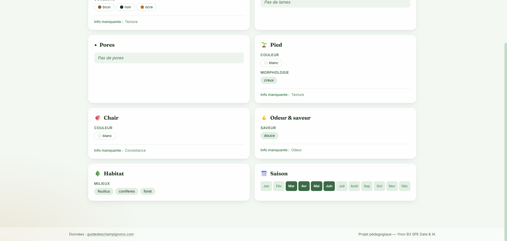
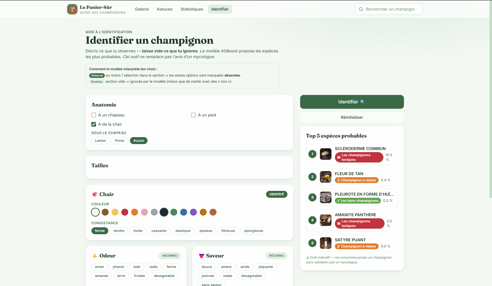
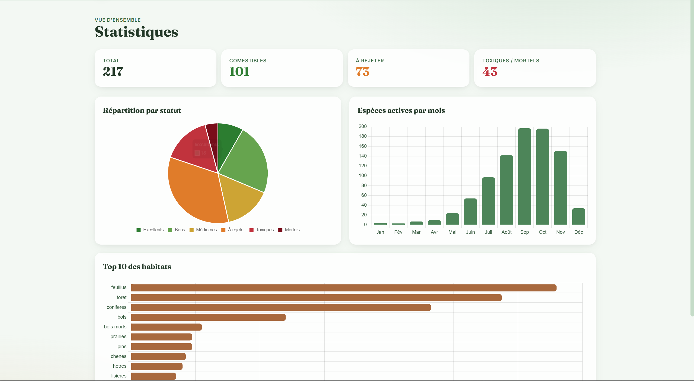
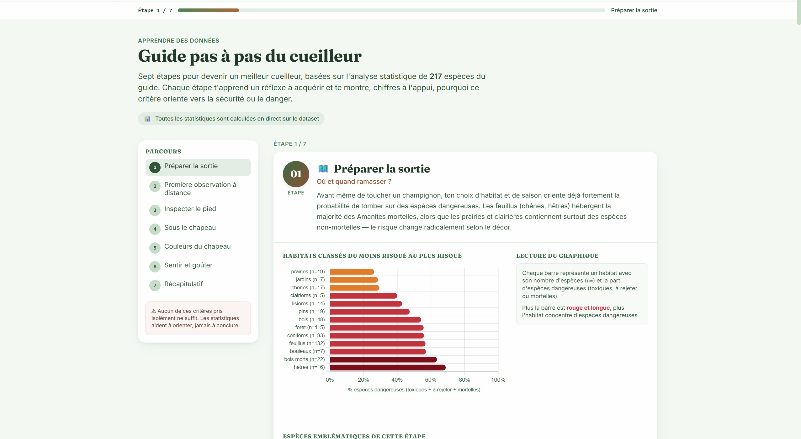

# Le Panier-Sûr — Application Web & Desktop

> SvelteKit + Tauri · Galerie & identification de champignons



---

## Stack technique

| Couche | Technologie |
|--------|------------|
| Framework | SvelteKit 2 / Svelte 5 |
| Desktop | Tauri 2 (Rust) |
| Style | Tailwind CSS 3 |
| Charts | Chart.js 4 |
| ML Runtime | ONNX Runtime Web |
| Parsing CSV | PapaParse |
| Build | Vite 5 |

---

## Prérequis

- [Node.js](https://nodejs.org/) ≥ 22
- [Rust + Cargo](https://rustup.rs/) ≥ 1.95 *(build desktop uniquement)*
- MSVC Build Tools 2022 *(Windows, build desktop uniquement)*

---

## Installation

```powershell
cd web\frontend
npm install
```

---

## Commandes

| Commande | Description |
|----------|-------------|
| `npm run dev` | Serveur de développement web (localhost:5173) |
| `npm run build` | Build de production web statique |
| `npm run preview` | Prévisualiser le build de production |
| `npm run tauri dev` | Application desktop avec hot-reload |
| `npm run tauri build` | Build `.exe` + installeurs Windows |
| `npm run check` | Vérification TypeScript / Svelte |

---

## Pages

### Galerie (`/`)

Parcourir 217 espèces avec recherche plein texte et filtres par statut, saison, habitat et couleur du chapeau.


### Fiche espèce (`/champignon/[slug]`)

Informations détaillées : comestibilité, tailles, morphologie (chapeau, pores, lames, pied, chair), habitats et saisons.





### Identification (`/predict`)

Décrire les caractéristiques observées — le modèle XGBoost propose les 5 espèces les plus probables, avec score de confiance et statut de comestibilité.



### Statistiques (`/stats`)

Vue d'ensemble du dataset : répartition par statut, espèces actives par mois, top 10 des habitats.



### Guide du cueilleur (`/astuces`)

7 étapes basées sur l'analyse statistique des 217 espèces — chaque étape explique un critère de sécurité avec ses données chiffrées.



---

## Build Desktop (.exe)

```powershell
npm run tauri build
```

Artefacts générés dans `src-tauri/target/release/` :

| Fichier | Description |
|---------|-------------|
| `le-panier-sur.exe` | Exécutable direct — double-clic, pas d'installation requise |
| `bundle/msi/Le Panier-Sûr_0.1.0_x64_en-US.msi` | Installeur MSI |
| `bundle/nsis/Le Panier-Sûr_0.1.0_x64-setup.exe` | Installeur NSIS |

### Mettre à jour l'icône

1. Remplacer `src-tauri/icons/source.png` (PNG 1024×1024)
2. Régénérer toutes les tailles :
   ```powershell
   npx @tauri-apps/cli icon src-tauri\icons\source.png
   ```
3. Relancer `npm run tauri build`

---

## Structure des fichiers

```
web/frontend/
├── src/
│   ├── lib/
│   │   ├── components/         # Composants Svelte réutilisables
│   │   │   ├── SearchBar.svelte
│   │   │   ├── FilterSidebar.svelte
│   │   │   ├── MushroomCard.svelte
│   │   │   ├── charts/         # Chart.js wrappers
│   │   │   └── ...
│   │   └── stores/             # Svelte stores (filtres, état global)
│   └── routes/                 # Pages SvelteKit
│       ├── +page.svelte        # Galerie (/)
│       ├── champignon/[slug]/  # Fiche espèce
│       ├── predict/            # Identification ML
│       ├── stats/              # Statistiques
│       └── astuces/            # Guide & quiz
├── static/
│   ├── data/                   # CSVs (champignons_clean.csv, meta JSON)
│   ├── img/                    # Photos des espèces
│   └── models/                 # Modèle ONNX + features/labels JSON
├── src-tauri/                  # Configuration Tauri (Rust)
│   ├── tauri.conf.json
│   ├── icons/                  # Icônes de l'application
│   └── src/                    # Code Rust
├── package.json
├── svelte.config.js
├── vite.config.ts
└── tailwind.config.js
```
